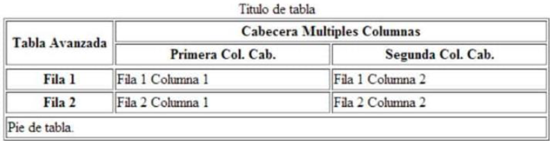

# ProyectoHTML
## Proyecto de Aprendizaje HTML5
###  Requisitos generales:  
- Ocho páginas en formato html secundarias con temas relacionados a la página principal.  
- Las páginas html, imágenes, audios, videos y otros recursos deberán estar organizadas en carpetas.
- Todas las páginas deberán tener un menú de navegación el cuál, permite al usuario navegar de una manera clara y sencilla entre todas las páginas HTML, tanto la principal como la secundaria.
- Todas las páginas html deben estar estructuradas según la semántica de HTML5.
- Todas las páginas html deben tener una etiqueta <header> la cuál, deberá contener una imagen (logo) relacionada al tema elegido.
- Todas las páginas html deben tener una etiqueta <footer> la cuál, deberá tener la información del estudiante como nombres completos, organización, correo (usar hipervínculo, mailto), teléfono (usar hipervínculo, tel), además deberá tener el símbolo de copyright junto a la leyenda de “Todos los derechos reservados”. Por ejemplo, © Todos los derechos reservados
- Las páginas html deberán tener al menos dos etiquetas <section>, <article> y <aside>.
- Todos los artículos <article> tengan al menos una imagen cada uno.
### Requisitos especificos:
De igual manera, se pide que al menos una de las páginas dentro del contenido de la etiqueta <article>, tengan los siguientes requisitos:
- Una tabla con la siguiente estructura:

- Un video de YouTube <iframe>
- Un video con la etiqueta <video>.
- Un audio con la etiqueta <audio>.
- Manejar listas ordenadas o desordenadas con al menos cinco ítems.
- Tener al menos cinco etiquetas de texto.
- Una de las páginas tenga al menos cuatro secciones <section> con tres artículos <article> cada sección. Luego, cada sección debe tener un encabezado <header>, en donde, se ubicaran enlaces que permitan navegar entre los artículos usando id’s
### Desarrollo
#### Pagina index.html
```
<!DOCTYPE html>
<!--Comentario de prueba HTML
5 etiquetas-->
<html lang="ES">      
    <head>
        <title>de TODO un POCO</title>
        <meta charset="UTF-8">
        <meta name="viewport" content="width=device-width, initial-scale=1.0">
        <meta name=”keywords” content="HTML prueba preparacion" />            
    </head>      
    <body>
        <header>
            <h1>Bazar de TODO un POCO</h1> 
            <nav>
                <ul>
                    <li><a href="Redes.html">Redes Sociales</a></li>
                    <li><a href="Localizaciones.html">Localizaciones</a></li>
                    <li><a href="index.html">Productos de la semana</a></li>
                    <li><a href="Lista.html">Oferta</a></li>
                    <li><a href="Pago.html">Metodos de pago</a></li>
                    <li><a href="Calificacion.html">Califiquenos</a></li>
                    <li><a href="Mision.html">Nosotros</a></li>
                    <li><a href="Credito.html">Credito Directo</a></li>
                </ul>
            </nav>
        <h2>La variedad es nuestra insignia</h2>
        
        </header>        
        <section id="Productos">
            <article>
                <header><h3>Productos de la semana</h3>
                </header>            
            <aside>
                <dl>
                <dt>
                    <i><strong>Limpiox</strong></i>
                </dt>
                <dd>
                    Producto que desinfecta en un 99% el area.
                </dd>
                <dt>
                    <i><strong>Carne de bobino</strong></i>
                </dt>
                <dd>
                    Carne de bobino de la <u>mejor</u> calidad
                </dd>
                <dt>
                    <i><strong>Leche Deslactosada</strong></i>
                </dt>
                <dd>
                    Pura, fresca
                </dd>
                <dt>
                    <i><strong>Cera para piso</strong></i>
                </dt>
                <dd>
                    Brillo constante para pisos
                </dd>
                <dt>
                    <i><strong>Pan</strong></i>
                </dt>
                <dd>
                    Fresco y delicioso
                </dd>
                <dt>
                    <i><strong>Whisky</strong></i>
                </dt>
                <dd>
                    Sabor britanico puro y de antaño
                </dd>
                <dt>
                    <i><strong>Detergente OMOX</strong></i>
                </dt>
                <dd>
                    Rinde 25% mas que los demas
                </dd>
                <dt>
                    <i><strong>Saborizalo!</strong></i>
                </dt>
                <dd>
                    Te saborizado. Delicioso al paladar
                </dd>
                <dt>
                    <i><strong>Queso Fabiola</strong></i>
                </dt>
                <dd>
                    Delicioso, fresco, <q>artesanal</q>
                </dd>
            </dl>
            </aside>
            </article>
        </section>
        <section>
            <article>
                <header><h3>Nuevos Productos</h3>
                    </header>
                <aside>
                    <dl>
                        <dt>
                            <i><strong>Leche de cabra</strong></i>
                        </dt>
                        <dd>
                            Nuevo producto, 100% natural, delicioso
                        </dd>                         
                        <dt>
                            <i><strong>Queso de cabra</strong></i>
                        </dt>
                        <dd>
                            Nuevo producto, 100% natural, delicioso
                        </dd>
                    </dl>
                </aside>                    
            </article>
        </section>
        <footer>Martin Bojorque&#8226;&nbsp;<a href="mailto:atencionclidnte@comdetup.com">Email:atencioncliente@comdetup.com</a>&#8226;<a href="tel:+5932543678">Telf:(593)2543678</a>&#8226;Todos los derechos reservados&#169;</footer>
    </body>
</html>
  
```
